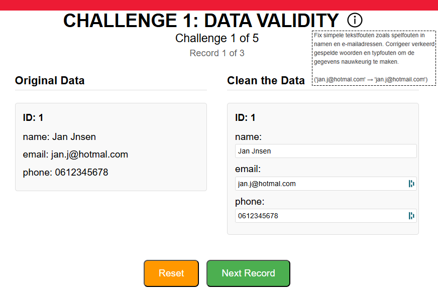
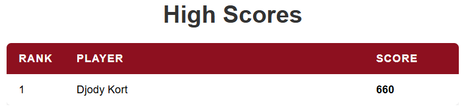

# Data Cleaning Game 🎮

Een interactieve, gamified webapplicatie die het abstracte concept 'data cleaning' tastbaar en begrijpelijk maakt.

\
\


## 🎯 Over het Project

Veel organisaties worstelen met datakwaliteit, maar het concept 'data cleaning' blijft vaak abstract voor niet-specialisten. Dit project pakt dit probleem aan door het proces te vertalen naar een interactieve game.

De applicatie is gebouwd als een **Minimum Viable Product (MVP)** en demonstreert een complete, moderne full-stack architectuur.

**Kern-features:**
*   **Gescheiden Architectuur:** Een strikte scheiding tussen de frontend (Vue.js) en de backend (Node.js) volgens professionele best practices.
*   **RESTful API:** De frontend en backend communiceren via een schone, logische RESTful API, gebouwd met Express.js.
*   **Interactieve Gameplay:** Gebruikers lossen data-opschoningspuzzels op en ontvangen directe feedback, wat het leerproces versnelt.

## 🛠️ Tech Stack

*   **Backend:** Node.js, Express.js
*   **Frontend:** Vue.js
*   **Database:** SQLite
*   **Architectuur:** 3-Laags (Presentatie, Business, Data), RESTful API
*   **Development:** Git, npm

## 🚀 Getting Started

Volg de onderstaande stappen om de applicatie lokaal op te zetten en te draaien.

### Prerequisites

Zorg ervoor dat je [Node.js](https://nodejs.org/) en npm (wordt meegeleverd met Node.js) op je systeem hebt geïnstalleerd.

### Installatie & Opstarten

De repository is opgesplitst in twee mappen: `backend` en `frontend`. Beide services moeten onafhankelijk van elkaar draaien.

1.  **Clone de repository naar je lokale machine:**
    ```bash
    git clone https://github.com/jouw-gebruikersnaam/data-cleaning-game.git
    cd data-cleaning-game
    ```

2.  **Setup de Backend Service:**
    *   Navigeer naar de backend map:
        ```bash
        cd backend
        ```
    *   Installeer de benodigde Node.js packages:
        ```bash
        npm i
        ```
    *   Start de backend server:
        ```bash
        node server.js
        ```
    *   De server zou nu moeten draaien. Laat dit terminalvenster open.

3.  **Setup de Frontend Service:**
    *   Open een **nieuw** terminalvenster en navigeer naar de frontend map:
        ```bash
        cd frontend
        ```
    *   Installeer de benodigde Node.js packages:
        ```bash
        npm i
        ```
    *   Maak een `.env` bestand aan in de `frontend` root. Kopieer de inhoud van `example.env` en plak dit in je nieuwe `.env` bestand. Dit is nodig om de frontend te laten weten waar de API draait.
    *   Start de frontend development server:
        ```bash
        npm run serve
        ```

4.  **Klaar!**
    *   De "Data Cleaning Game" zou nu succesvol moeten draaien. Open je browser en navigeer naar `http://localhost:8080` (of de poort die in je terminal wordt aangegeven).

## 📂 Projectstructuur
Zorg dat binnen de 'frontend' folder een '.env' file aangemaakt is met de parameter:
'VUE_APP_API_URL'

**Default value:**\
VUE_APP_API_URL=http://localhost:3000/api

```
data-cleaning-game/
├── backend/ # Bevat de Node.js/Express API en de SQLite database
│ ├── database/
│ └── server.js
└── frontend/ # Bevat de Vue.js applicatie
├── public/
├── src/
├── .env # (Jouw lokale API configuratie)
└── example.env
```

## 📧 Contact

Djody Kort - [LinkedIn Profiel](https://www.linkedin.com/in/djody-kort/)\
Dinand Nafzger - [LinkedIn Profiel](https://www.linkedin.com/in/dinand-nafzger-3a1ab0241/)\
Martijn Theeuwen - [LinkedIn Profiel](https://www.linkedin.com/in/martijn-theeuwen/)
